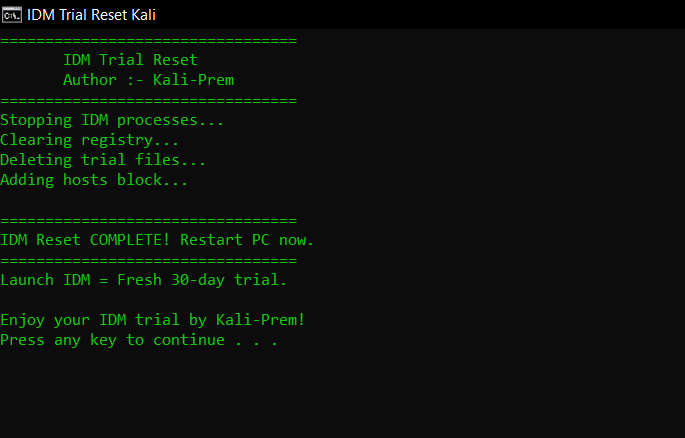

# ⚡ IDM Activation & Trial Reset Script

Use IDM forever without cracking. If you can, then buy a license to support the IDM developer.

---



## 🚀 Method 1: Batch File (No PowerShell Policy Issues)

Easily reset the trial period and activate IDM in just a few steps — no technical setup required.

## 📥 Steps to Follow
1. Download the [Reset-idm-kali.bat](https://github.com/Kali-Prem/IDM-Activation-Tool/releases/download/v1.0.0-stable/Reset-idm-kali.bat) file
2. Double-click the file to run it
3. The script will automatically:  
   🔄 Reset the trial period  
   ✅ Activate IDM
4. Restart your computer
### 🎉 Enjoy your activated IDM with a fresh trial period!  

---

💥💢💢💢💥💢💢💢💥💢💢💢💥💢💢💢💥💢💢💢💥💢💢💢💥💢💢💢💥

## 🛠️ Method 2: Manual Registry + Files Clean

### 📂 Step 1: Remove Residual Files

Delete the following folders (replace [Username] with your actual username):  
###### [ Note: AppData folders are hidden by default. You may need to enable "Show hidden files" in File Explorer to access them. ]

```powershell 
C:\Users\[Username]\AppData\Roaming\IDM\
C:\Users\[Username]\AppData\Local\IDM\
C:\ProgramData\IDM\
```
### 🧹 Step 2: Clean Registry (Advanced)
Open Command Prompt as Administrator  
Run the following commands:  
```powershell
reg delete "HKCU\Software\DownloadManager" /f
reg delete "HKLM\Software\DownloadManager" /f
```
### 🔄 Step 3: Restart Your PC

After restarting, reinstall the software using the official installer.
### 🎉 Enjoy your activated IDM with a fresh trial period!
---

============================================================


## ⚠️ Disclaimer

This project is for **educational and troubleshooting purposes only**.  
Users must comply with software licensing and terms of use.

---

## ⭐ Support

If this helped you:

- ⭐ Star this repo  
- 🍴 Fork it  
- 🛠️ Contribute improvements  

---

## 👨‍💻 Author
  
== **Kali-Prem** == 
= 
Passionate about software, productivity, and sharing knowledge. Dedicated to creating tools that empower users to get the most out of their software. Always learning and improving.

Made with ❤️ for learning and productivity

